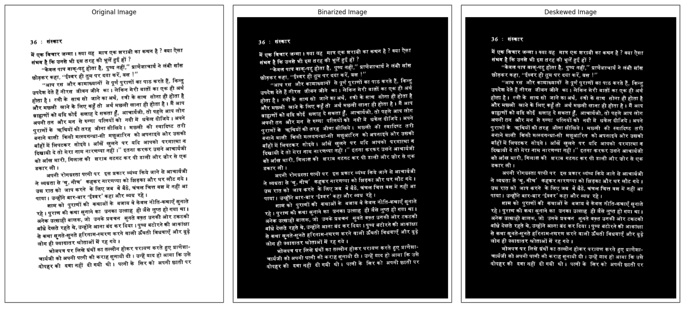
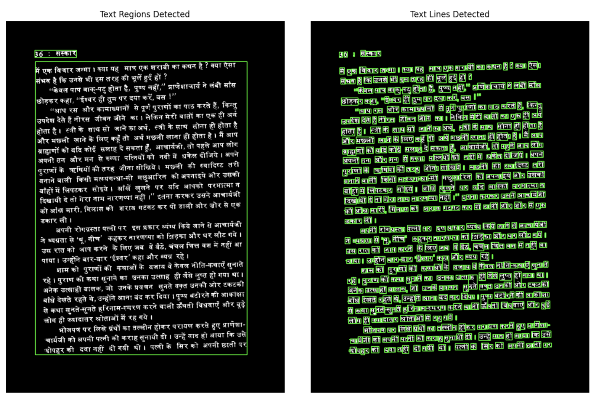
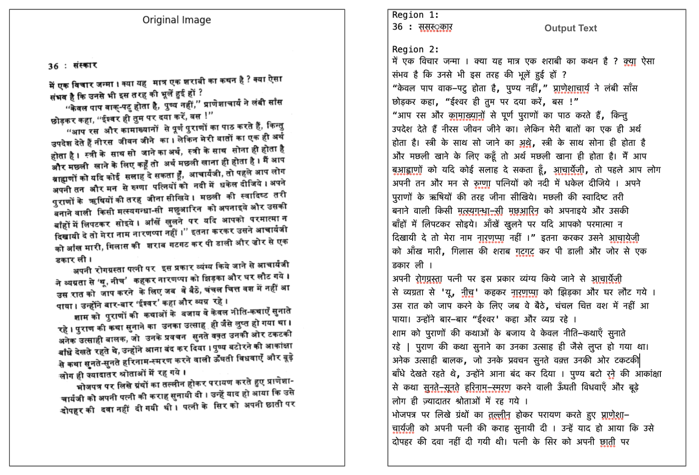

# 🌳 **salOCR**

## Overview
This project processes Hindi PDF files to extract text using Optical Character Recognition (OCR). The core functionality is implemented in the `main.py` file within the `salOCR` directory. It is designed to handle bulk processing of PDF files, making it particularly useful for large datasets like digitized books or scanned documents in Hindi.

## How It Works
1. PDF files are converted into images using the `pdf2image` library.
2. The images are then binarized to improve text clarity.
3. Text regions are detected, and text is extracted using `pytesseract`.

## Example Usage
To process PDF files stored in a folder:

1. Place your PDF files in a folder (e.g., `HindiBooks`) within the `salOCR` directory.
2. Run the following command from the terminal:
   ```bash
   python main.py
   ```

## Image Processing Workflow
Below is an illustration of how the system processes a sample PDF page:

**Original Image | Binarized Image | Deskewed Image**



## Text Detection
During processing, text regions and lines are detected as shown below:

**Text Regions Detected | Text Lines Detected**


## Example Output
Below is an example of the output text generated from an input PDF page:

**Original Image | Output Text**


# Initial Result of Processing 20 Hindi PDF files inside a folder:
- Average time taken to process each page: **~5 seconds**
- PDFs with only text showed the best results.
- PDFs containing images or illustrations yielded poor results (#TODO).
- Accuracy of text conversion was high (based on visual inspection; no quantitative analysis was performed).

## TODO List
1. Improve OCR performance for PDFs containing images and illustrations.
2. Enhance recognition for PDFs with older Hindi alphabet print styles.
3. Implement noise reduction techniques for cleaner output from noisy input files.
4. Add parallel processing capabilities to speed up the PDF-to-text conversion.

## System Information
| Component    | Version          |
|--------------|------------------|
| Platform     | macOS-13.5-arm64-arm-64bit |
| Python       | 3.12.0           |
| NumPy        | 2.2.1            |
| OpenCV       | 4.10.0           |
| pdf2image    | 1.17.0           |
| pytesseract  | 0.3.13           |

## Improving the Quality of Output
For better OCR results, refer to the [Tesseract documentation](https://tesseract-ocr.github.io/tessdoc/ImproveQuality.html). Adjusting parameters like image resolution, binarization thresholds, and text region detection can significantly enhance accuracy.

## Notes
- This project works best with clean, text-only PDF files.
- Current limitations include poor performance with PDFs containing images or heavily stylized text.
- Contributions and improvements are welcome to address the TODO items and improve the overall functionality.

---
**Author:** Vann AI   
**Contact:** vannai.org@gmail.com  
**License:** MIT
